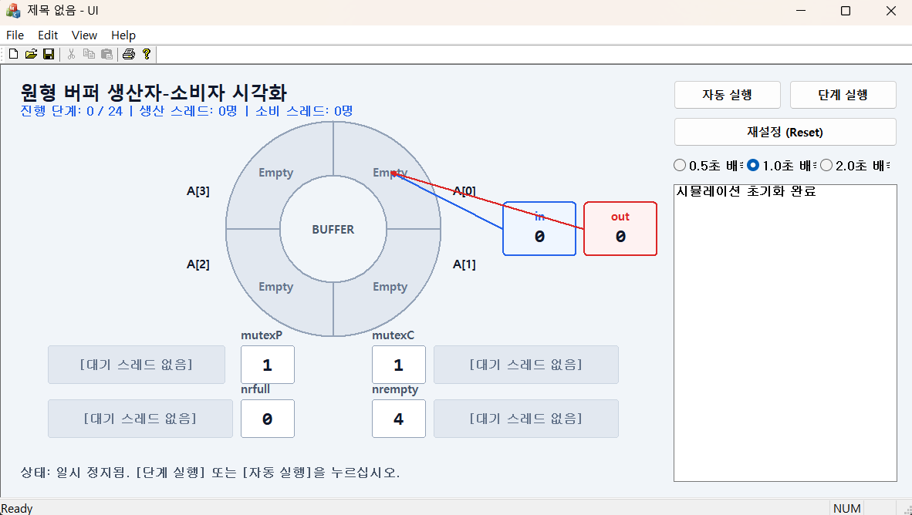
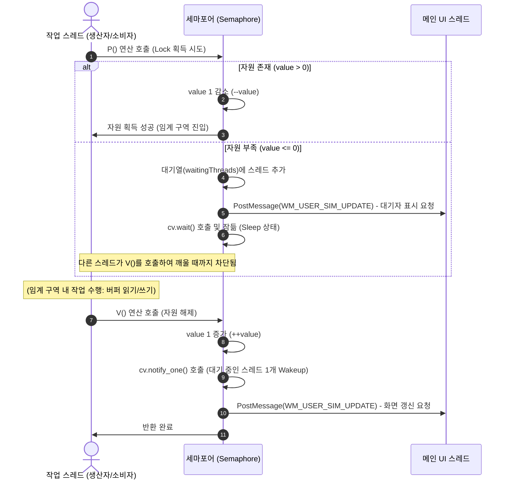
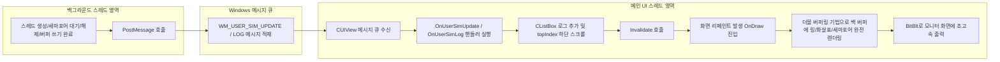


## 0. 시스템 개요

멀티스레드 동기화 메커니즘을 MFC GUI 환경에 표현 통합하기 위해  
**RingBuffer.h의 세마포어 설계**와 **MFC 모델-뷰(Doc-View) 기반 구현**을 중점으로 개발하였습니다.  

### 메인 화면


### 0.1 RingBuffer.h 설계 측면 (RingBuffer.h Design)
* **목표**: 콘솔 기반의 `Semaphore`와 `RingBuffer` 구조를 완벽하게 스레드 세이프하게 구현하고, 실시간 스레드 차단/대기 상태를 시각화할 수 있는 인터페이스를 내장하는 것.
* **접근 방식 및 계획**:
  1. **대기열 추적 기능 (`waitingThreads`)**: 세마포어 자원이 없어 대기 상태(`cv.wait`)에 걸린 스레드의 명단을 실시간 수집하는 벡터 큐를 `Semaphore` 구조체 내에 구현.
  2. **비동기 UI 알림 연결 (`PostMessage`)**: 자원 획득 수치 변화 및 대기열 등록/제거 이벤트 발생 시, UI 스레드에 비동기 메시지(`WM_USER_SIM_UPDATE`)를 안전하게 통지하도록 설계.
  3. **데드락 프리 조기 퇴출 메커니즘**: 시뮬레이션 중도 리셋 시, 잠자고 있는 스레드를 안전하게 깨워 자원 감소 없이 즉각 종료시킬 수 있는 `terminateFlag` 연동 P 연산 설계.

### 0.2 MFC 모델-뷰 구현 측면 (MFC Model-View Implementation)
* **목표**: 비즈니스 동기화 로직과 그래픽 렌더링 영역을 엄격하게 격리하고, 화면 깜빡임이 없는 부드러운 대시보드 작화와 조작 인터페이스를 구성.
* **접근 방식 및 계획**:
  1. **Document (Model) 역할 정립**: `CUIDoc` 클래스에서 원형 버퍼의 상태 데이터, 24단계 백엔드 시나리오 실행 스레드 풀, 조작 스패너 루프, 스레드 안전한 로그 보관 큐를 중앙 관리하도록 설계.
  2. **View (Visual Render) 역할 정립**: `CUIView` 클래스에서 좌측에 더블 버퍼링 기법의 고선명 GDI 벡터 그래픽 버퍼/세마포어 도판을 렌더링하고, 우측에 반응형 사이드바 제어 패널(Play, Step, Reset, CListBox 로그)을 통합하도록 구현.
  3. **비동기 메시지 맵 바인딩**: 백그라운드 스레드의 `PostMessage` 신호를 `CUIView` 메시지 맵 핸들러(`OnUserSimUpdate/Log`)로 안전하게 수신하여 화면 갱신 및 로그 하단 자동 스크롤을 수행하는 IPC 파이프라인 수립.

---

## 1. 기능 플로우 (Functional Flow)

시뮬레이션 시스템은 크게 **[스레드 동기화 플로우]**, **[시뮬레이션 흐름 제어 플로우]**, **[비동기 UI 갱신 플로우]**의 3가지 핵심 흐름으로 동작합니다.

### 1.1 스레드 수준 동기화 및 자원 획득 플로우
생산자(Producer)와 소비자(Consumer) 스레드는 Semaphore의 P/V 연산과 조건 변수(Condition Variable)를 이용하여 임계 구역(Critical Section) 진입 및 실행 순서를 동기화합니다.



---

### 1.2 시뮬레이션 제어 플로우 (Control Flow)
조작 패널의 버튼 조작에 따라 시뮬레이션 진행 상태가 제어됩니다.

* **단계 실행 (Step) 플로우**:
  1. 현재 시나리오 인덱스(`m_currentStepIndex`)가 시나리오 최대 크기(24) 미만인지 확인합니다.
  2. 인덱스에 해당하는 명령 문자열(`"P"` 또는 `"C"`)을 읽고 인덱스를 1 증가시킵니다.
  3. `"P"` 이면 백그라운드 생산자 스레드(`ProducerTask`)를 생성하고, `"C"` 이면 백그라운드 소비자 스레드(`ConsumerTask`)를 생성하여 실행 대기열(`m_workers`)에 추가합니다.
  4. 비동기 스레드 실행에 따라 화면이 갱신됩니다.
* **자동 실행 (Play / Pause) 플로우**:
  1. [자동 실행] 클릭 시, 백그라운드에서 시뮬레이션 오토 스패너 스레드(`AutoPlayLoop`)를 작동시킵니다.
  2. `AutoPlayLoop`는 지정된 배속 시간 주기(0.5초 / 1.0초 / 2.0초)마다 `ExecuteNextStep()`을 주기적으로 강제 실행합니다.
  3. [일시 정지] 클릭 시, 취소 상태 플래그를 켜고 오토 루프를 즉시 중단(Break)한 뒤 백그라운드 스패너 스레드를 정리합니다.
* **재설정 (Reset) 플로우**:
  1. 실행 중인 자동 타이머 루프를 종료합니다.
  2. 스레드 강제 퇴출 통신 프로토콜을 가동하여 현재 대기 중인 모든 스레드를 소멸시킨 후 수집 완료합니다.
  3. 원형 버퍼의 `in/out` 포인터를 `0`으로 맞추고 버퍼 내부를 완전히 비웁니다.
  4. `mutexP=1, mutexC=1, nrfull=0, nrempty=4` 초기 수치로 세마포어 상태를 원복합니다.
  5. UI 로그 상자를 리셋하고 전체 화면(`Invalidate`)을 갱신합니다.

---

### 1.3 UI 갱신 비동기 플로우 (UI Thread Safety)
멀티스레드 환경에서 백그라운드 스레드가 GUI 그리기 객체(CDC)에 직접 접근하면 **Access Violation** 크래시가 발생하므로, 완전한 스레드 세이프 비동기 업데이트 방식을 사용합니다.



---

## 2. 인터페이스 입출력 정의 (Interface Input/Output Definitions)

시뮬레이터 프로그램의 데이터 흐름은 **[사용자 조작 입력]**, **[스레드 상태 간 메시징 인터페이스]**, **[GUI 그래픽 출력 및 로그 정보 창]**으로 설계하였습니다.

### 2.1 사용자 조작 입력 인터페이스
사용자가 물리적인 마우스 클릭을 통해 프로그램 상태를 변화시키는 제어 채널입니다.

| 입력 항목 (Control ID) | 형식 (Control Type) | 데이터 범위 및 속성 | 기능 설명 |
| :--- | :--- | :--- | :--- |
| **자동 실행 / 일시 정지**<br>(`IDC_BTN_PLAY`) | `CButton` (Button) | 현재 실행 중인 자동 스패너 루프의 토글 제어 | 자동 실행 상태면 "일시 정지"로 동작하며 루프를 탈출시킵니다. 일시 정지 상태면 스패너 스레드를 동작시켜 자동 순차 실행을 진행합니다. |
| **단계 실행 (Step)**<br>(`IDC_BTN_STEP`) | `CButton` (Button) | 시나리오 단계별 수동 수행 (0~24) | 현재 시나리오 단계의 스레드 한 명을 소환하여 실행시키고 정지합니다. (자동 실행 중에는 중복 실행 방지를 위해 비활성화) |
| **재설정 (Reset)**<br>(`IDC_BTN_RESET`) | `CButton` (Button) | 프로그램 상태 전반의 하드 리셋 | 실행/대기 중인 스레드를 수집하여 즉시 종료하고, 모든 세마포어 상태와 버퍼 정보, 로그들을 완전히 최초 상태로 되돌립니다. |
| **배속 조작**<br>(`IDC_RAD_SPEED500` ~ `2000`) | `CButton` (Radio Button) | 수치: `500ms` / `1000ms` / `2000ms` | 자동 재생 실행 시, 각 단계별 스레드 소환 시간 간격 간 배속을 설정합니다. (1.0초 기본값) |

---

### 2.2 스레드 안전 메시징 인터페이스 (IPC / Message Map)
작업 스레드가 자원 획득 상태 전이 결과를 메인 UI 스레드에게 알려주기 위해 사용하는 Win32 비동기 메시지 인터페이스 규격입니다.

#### A. `WM_USER_SIM_UPDATE` (정적 화면 리페인트 알림)
* **메시지 ID**: `WM_USER + 100`
* **송신자**: `Semaphore::P()`, `Semaphore::V()`, `CUIDoc::ExecuteNextStep()`, `CUIDoc::ResetSimulation()`
* **수신자**: `CUIView`
* **전달 인자**: `wParam = 0`, `lParam = 0` (사용 안 함)
* **처리 결과**: 우측 패널의 버튼 활성화 상태를 재정비하고 화면 무효화 영역 선언(`Invalidate(FALSE)`)을 통해 더블 버퍼링 그리기(`OnDraw`)를 유도합니다.

#### B. `WM_USER_SIM_LOG` (시뮬레이션 로그 기록 알림)
* **메시지 ID**: `WM_USER + 101`
* **송신자**: 스레드 안전 Logger 메서드 `CUIDoc::AddLog()`
* **수신자**: `CUIView`
* **전달 인자**: `wParam = 0`, `lParam = 0` (사용 안 함, 문맥은 Document의 동기화 큐 참조)
* **처리 결과**: Document에 안전하게 보관된 로그 큐의 증가분을 리스트 박스(`CListBox`)에 삽입하고, 새로 유입된 줄이 보이도록 하단으로 강제 자동 스크롤(`SetTopIndex`)합니다.

---

### 2.3 GUI 그래픽 출력 인터페이스
더블 버퍼링 기법을 통해 뷰어 화면(좌측 70% 영역)에 정밀 렌더링되어 출력되는 시각 정보 명세서입니다.

```
[원형 버퍼 데이터 영역 (Outer R = 140, Inner r = 70)]
- A[0] (우상단), A[1] (우하단), A[2] (좌하단), A[3] (좌상단)
- 비어있음: RGB(226, 232, 240) (연한 회색-슬레이트 톤) 및 "Empty" 출력
- 채워짐: RGB(16, 185, 129) (초록색) 및 생산 데이터 이름 출력

[in & out 포인터 지시 화살표]
- in: 파란색 상자(RGB(37, 99, 235))와 포인터 지시 화살표
- out: 빨간색 상자(RGB(220, 38, 38))와 포인터 지시 화살표

[세마포어 및 스레드 대기열 2열 배치 테이블]
- 좌측 열: 
  * mutexP (수치: RGB(255, 255, 255) 상자 | 대기열: 주황색 RGB(217, 119, 6) 텍스트로 잠든 생산자 나열)
  * nrfull  (수치: RGB(255, 255, 255) 상자 | 대기열: 주황색 RGB(217, 119, 6) 텍스트로 잠든 소비자 나열)
- 우측 열:
  * mutexC (수치: RGB(255, 255, 255) 상자 | 대기열: 주황색 RGB(217, 119, 6) 텍스트로 잠든 소비자 나열)
  * nrempty (수치: RGB(255, 255, 255) 상자 | 대기열: 주황색 RGB(217, 119, 6) 텍스트로 잠든 생산자 나열)
```

---

## 3. 소스코드 구조 (Source Code Structure)

본 프로젝트는 구조적 응집도(Cohesion)와 유지보수 편의를 위해 완벽한 **역할 분할 아키텍처(Separation of Concerns)**로 컴포넌트가 격리 설계되었습니다.

### 3.1 파일 구성 및 클래스 역할 정의
시뮬레이션 시스템의 전체 모듈 구성도입니다.

```
 Producer-Consumer-Patterns-Implement\
 ├── include            
 │   ├── RingBuffer.h     [핵심 동기화 클래스 (Semaphore, RingBuffer Struct)]
 │   ├── UIDoc.h,         [시뮬레이션 상태/스레드 관리 클래스 (CUIDoc)]
 │   ├── UIView.h         [GDI 더블버퍼링 그래픽 및 사이드바 컨트롤 클래스 (CUIView)]
 │   ├── UI.h             [MFC 메인 App 애플리케이션 진입점 클래스 (CUIApp)]
 │   └── MainFrm.h        [SDI 최외곽 윈도우 프레임 관리 클래스 (CMainFrame)]
 └── src       
     ├── UIDoc.cpp       
     ├── UIView.cpp    
     ├── UI.cpp         
     └── MainFrm.cpp    
```

| 모듈명 | 물리 파일 | 담당 역할 및 클래스 정의 |
| :--- | :--- | :--- |
| **핵심 동기화 레이어** | `RingBuffer.h` | <ul><li>**`struct Semaphore`**: 조건 변수 기반의 동기화 및 `waitingThreads`를 활용한 실시간 대기 스레드 명단 관리</li><li>**`struct RingBuffer`**: 공통 원형 배열 버퍼 공간 및 세마포어 모듈 세트 보유</li></ul> |
| **시뮬레이션 통제 레이어** | `UIDoc.h`<br>`UIDoc.cpp` | <ul><li>**`class CUIDoc` (CDocument 상속)**</li><li>공유 `RingBuffer` 원격 제어 및 단계별/자동 재생 시나리오 구동 스레드 엔진</li><li>스레드 안전한 Logger API 제공 및 강제 자원 리셋 관리</li></ul> |
| **시각화 및 컨트롤 레이어** | `UIView.h`<br>`UIView.cpp` | <ul><li>**`class CUIView` (CView 상속)**</li><li>깜빡임 없는 더블 버퍼링 기법의 고선명 GDI 벡터 그래픽 구현</li><li>포인터 회전 화살표 및 세마포어 격자판 배치 작화</li><li>사이드바 조작 컨트롤 조작 핸들러 맵핑</li></ul> |

---

### 3.2 핵심 알고리즘 아키텍처 분석

#### A. 스레드 세이프 대기 추적 Semaphore P 연산 (RingBuffer.h)
Dijkstra의 모델을 C++ 표준 멀티스레딩 라이브러리로 온전히 포팅하면서, UI 표시 대기 리스트를 추적할 수 있게 개량한 핵심 알고리즘입니다.


#### B. 4분면 텍스트 기하학적 정밀 중앙 배치 알고리즘 (UIView.cpp)
외경 반지름 $R$과 내경 반지름 $r$을 갖는 임의의 동심원 분할 부채꼴 내부의 무게중심(글씨 배치 영역)을 계산하기 위해 적용된 45도 삼각함수 물리 좌표 오프셋 알고리즘입니다.

$$\text{offset} = R_{\text{mid}} \times \cos(45^\circ) = \frac{R + r}{2} \times 0.7071 = (R + r) \times 0.3535$$

이 수학적 공식에 기반하여 정밀 배치 연산이 수행됩니다.

## 4. 프로그램 실행 과정

### 4.1 빌드 방법
1) UI.sln을 클릭해 Visualstudio를 실행합니다.
2) Ctrl + Shift + B 단축기 또는 Build의 Build Solution을 실행합니다.
3) Ctrl + F5 단축키로 디버그 없이 실행합니다.
(주요 파일 : Ringbuffer.h, UIDoc.(h/cpp), UIView.(h/cpp))

### 4.2 초기 시나리오
```
생산자(1) – 소비자(1) – 소비자(2) – 소비자(3) - 생산자(2) 
생산자(3) – 생산자(4) – 생산자(5) – 생산자(6) – 생산자(7) 
생산자(8) – 생산자(9) – 소비자(4) – 생산자(10) – 생산자(11) 
생산자(12) – 소비자(5) – 소비자(6) – 소비자(7) – 소비자(8) 
소비자(9) – 소비자(10) – 소비자(11) - 소비자(12)
```